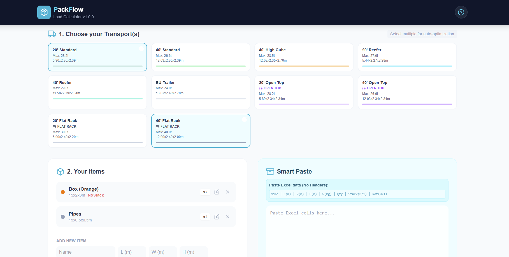

# 📦 PackFlow - Calculadora de Carga Inteligente

[](README.md)
[](README_ES.md)

> **Optimiza tu logística de envío en segundos con visualización 3D.**


**PackFlow** es una aplicación web potente y ligera diseñada para resolver el complejo "Problema de empaquetado de contenedores" (Bin Packing Problem) para profesionales de la logística. Calcula automáticamente la mejor configuración de contenedores para tu carga, visualizando el resultado en un entorno 3D interactivo.

Soporta contenedores estándar (20', 40', HC) así como equipos especiales como **Open Tops** y **Flat Racks**.

---

## 🚀 Características Clave

*   **🧠 Algoritmo Inteligente:** Ordena automáticamente los artículos en función del tamaño, apilabilidad y restricciones de volumen.
*   **🚚 Soporte Multi-Contenedor:** Desde Dry Vans estándar hasta Flat Racks y Open Tops.
*   **🧊 Visor 3D Interactivo:** Inspecciona tu carga desde todos los ángulos utilizando tecnología Three.js.
*   **⚡ Feedback Instantáneo:** Cálculo en tiempo real de límites de peso, uso de volumen y estabilidad (Centro de Gravedad).
*   **📊 Importación Inteligente:** Copia y pega tu lista de empaque directamente desde Excel.
*   **📑 Informes Profesionales:** Exporta un manifiesto CSV detallado de tu plan de carga optimizado.

## 🛠️ Stack Tecnológico

Construido con un stack moderno enfocado en el rendimiento:
*   **React 18** - Determina la lógica de la UI.
*   **Vite** - Herramienta de construcción ultra rápida.
*   **Three.js** - Renderizado 3D físicamente preciso.
*   **TailwindCSS** - Estilos hermosos y responsivos.

## 🏁 Primeros Pasos

### Prerrequisitos
Necesitas [Node.js](https://nodejs.org/) instalado en tu máquina.

### Instalación

1.  Clona este repositorio:
    ```bash
    git clone https://github.com/yourusername/packflow.git
    cd packflow
    ```

2.  Instala las dependencias (se recomienda pnpm):
    ```bash
    pnpm install
    ```

3.  Inicia el servidor de desarrollo:
    ```bash
    pnpm dev
    ```

4.  Abre `http://localhost:5173` en tu navegador.




## Estructura del Proyecto
```bash
src/
├── components/
│   ├── common/           # Componentes UI genéricos (Iconos, Modales, Toasts)
│   ├── layout/           # Componentes de diseño (Header)
│   ├── packing/          # Paso 1: Componentes de configuración y entrada
│   ├── results/          # Paso 2: Componentes de visualización y métricas
│   └── Visualizer3D.jsx  # Lógica central de visualización Three.js
├── data/
│   └── containers.js     # Definiciones estándar de contenedores (ISO, FR, OT)
├── utils/
│   └── packingAlgorithm.js # Algoritmo de empaquetado (First Fit Decreasing)
├── App.jsx               # Gestor de estado principal y controlador de vista
└── main.jsx              # Punto de entrada
```

## Licencia

Privado - Creado por [isabosdev](https://github.com/isa-bos-dev).
